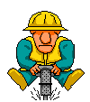

# **Introducción**
El robot [EscornaRover](https://www.thingiverse.com/thing:4911480) diseño de [OPCION3D](http://www.opcion3d.com/) convierte al robot [Escornabot](https://escornabot.com) en un robot con tracción en las cuatro ruedas.

El [Escornabot](https://escornabot.com)

Escornabot Singularis

Se rediseña en un robot rover [EscornaRover](https://www.thingiverse.com/thing:4911480)

EscornaRover

En este repositorio encontrarás desarrollo y programación del robot para distintos proyectos.

En contrucción

