

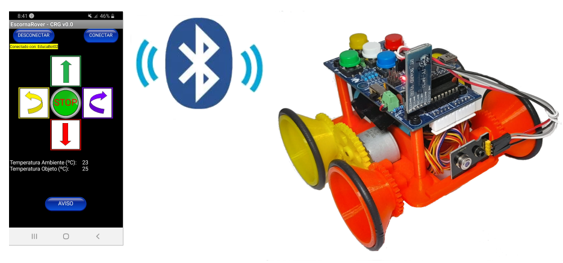

## **EscornaRover Explorador**
El EscornaRover Explorador está rediseñado para adaptarse a los retos de la Misión a Marte.

* La altura y colocación de los soportes para la tarjeta CPU están modificados:
    * La altura debido a que se ha cambiado a un portapilas de 2x16850 para aumentar la autonomía.
    * La versión de la CPU 2.20 tiene una longitud mayor.

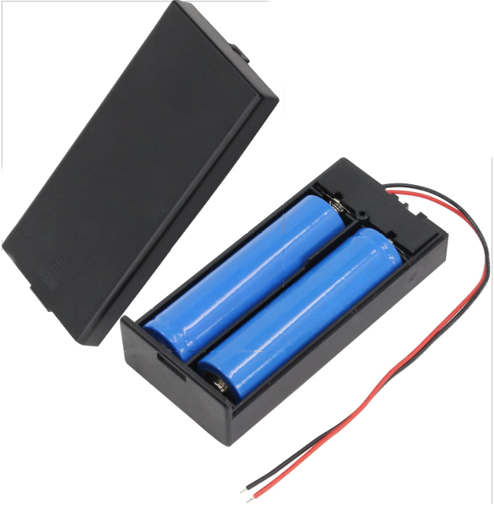

Portapilas 2x18650

    

|    |    |
| :-:| :-:|
| 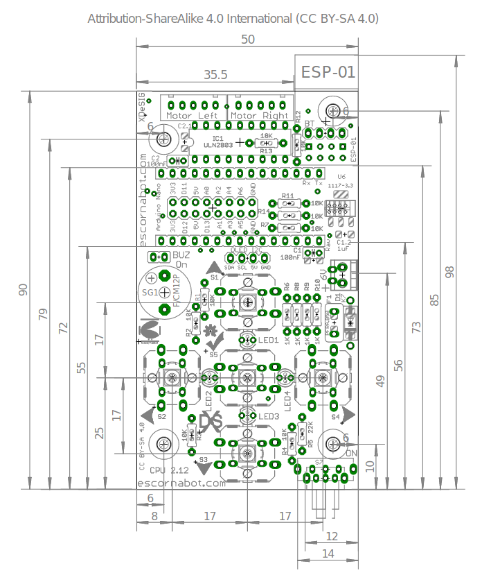 | 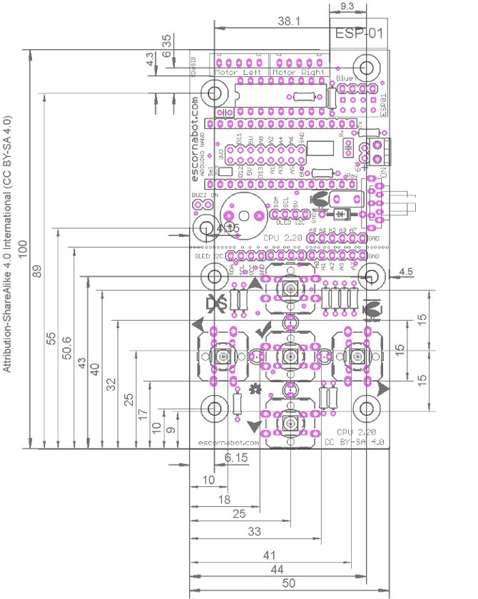 |
| _CPU v2.12 [XDeSiG](https://github.com/xdesig/escornabot-electronics/blob/master/Electronics/EscornaCPU/2.x/2.12/Caracteristicas_CPU2_12_es.pdf)_ | _CPU v2.20 [XDeSiG](https://github.com/xdesig/escornabot-electronics/blob/master/Electronics/EscornaCPU/2.x/2.20/Escorna_CPU_2_20_Measures.png)_ |

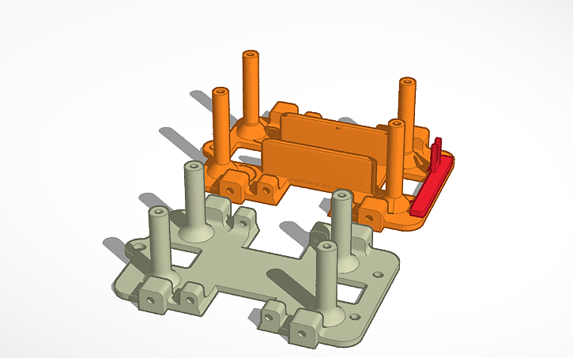

[Comparación de chasis EscornaRover](https://www.tinkercad.com/things/2zMozfIr76i)

* Los módulos electrónicos que se añaden son:
    * Módulo bluetooth HC-06 o HC-05 para las comunicación con la app del móvil.
    * Sensor de temperatura por IR.

|    |    |
| :-:| :-:|
| 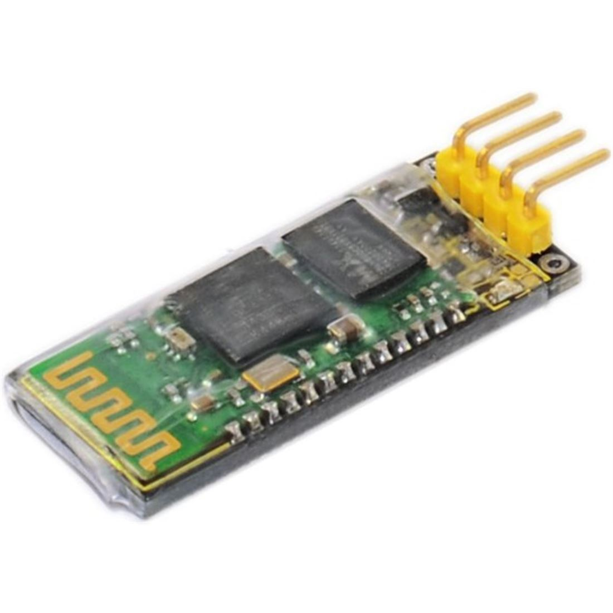 | 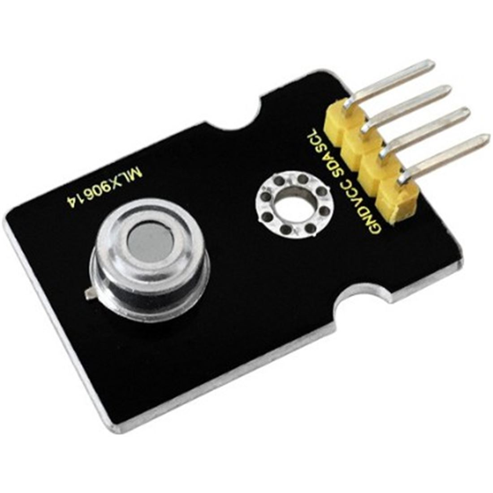 |
| _[Bluetooth HC-06](https://shop.innovadidactic.com/es/standard-perifericos/648-keyestudio-modulo-bluetooth-hc-06.html)_ | _[Temperatura IR](https://shop.innovadidactic.com/es/standard-sensores/756-keyestudio-sensor-de-temperatura-infrarojo-sin-contacto-mlx90614.html)_ |

## **App de control**
El control y comunicación por bluetooth con el robot EscornaRover Explorador se hace mediante una app programada en [App Inventor](http://ai2.appinventor.mit.edu) y de referencia la app de [Escornabot publicada por Lobo_tic](http://ceipmiskatonic.blogspot.com/2015/04/controlar-el-escornabot-por-bluetooth.html).

El proyecto de la App tiene dos partes:
### **1.- Diseño de la GUI (interfaz gáfico)**

|    |    |
| :-:| :-:|
| 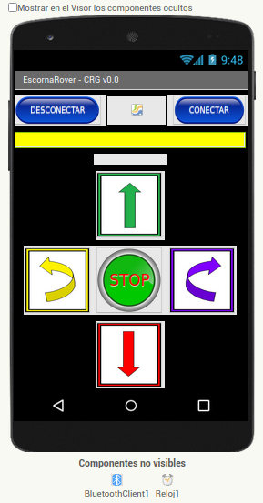 | 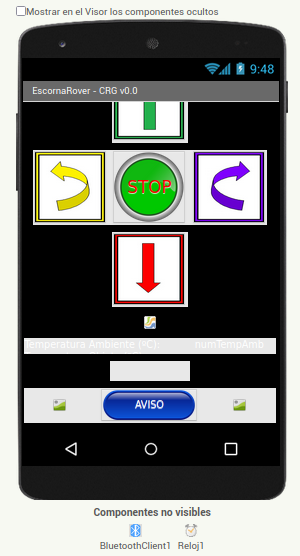 |
| 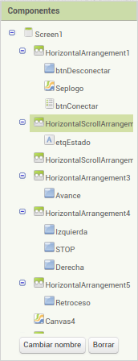 | 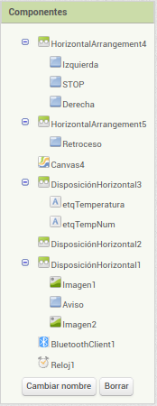 |
| _Interfaz Gráfico de Usuario (GUI)_ |

### **2.- Programación bloques**

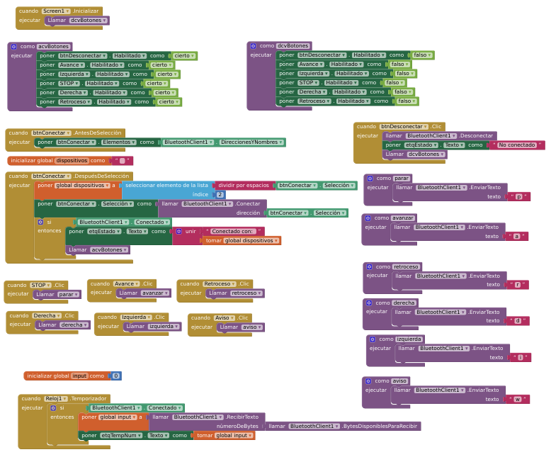

Archivos de la App de EscornaRover.

* [Código fuente .aia](https://github.com/leobotmanuel/ExploradorEscornaRover/blob/main/docs/misionMarte/escornaRover03.aia)
* [App ejecutable en Android .apk](https://github.com/leobotmanuel/ExploradorEscornaRover/blob/main/docs/misionMarte/escornaRover03.apk)

## **Programación Arduino Nano**
La programación se desarrolla con el lenguaje visual de programación [ArduinoBlocks](http://www.arduinoblocks.com) para un proyecto tipo Arduino Nano.

### **Inicialización**
En el bloque de "Inicializar" colocamos el bloque de comunicación al puerto serie para la comunicación con el módulo bluetooth, las variables y los bloques de configuración de los motores paso a paso.

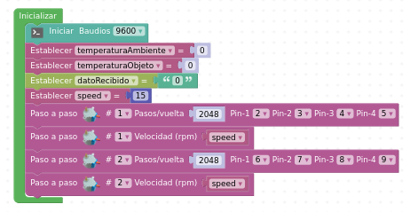

### **Funciones**
Declaramos unas funciones para los movimientos y la señal luminosa de aviso.
 

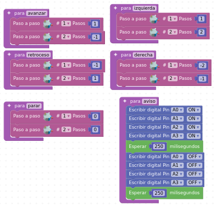

### **Programa Principal**
El bloque "Bucle" empieza con los bloques de instrucciones condicionales que recibo los datos de la App y ejecuta la orden recibida. Continua con un bloque temporizador que a cada 500ms envía los datos de temperatura ambiente y del objeto.
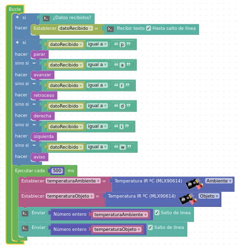

