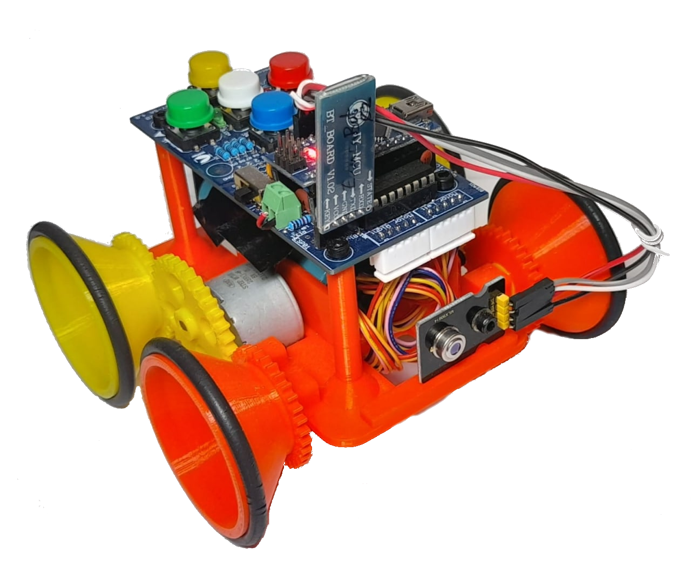
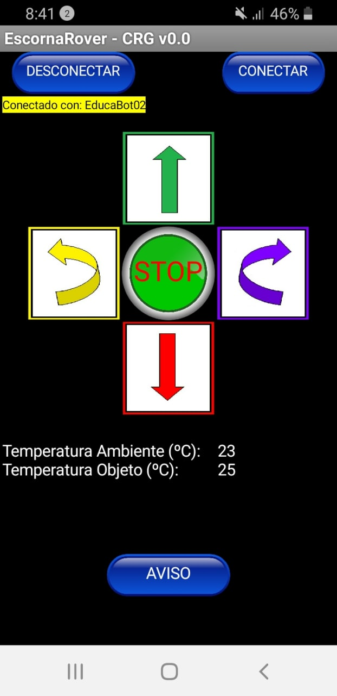
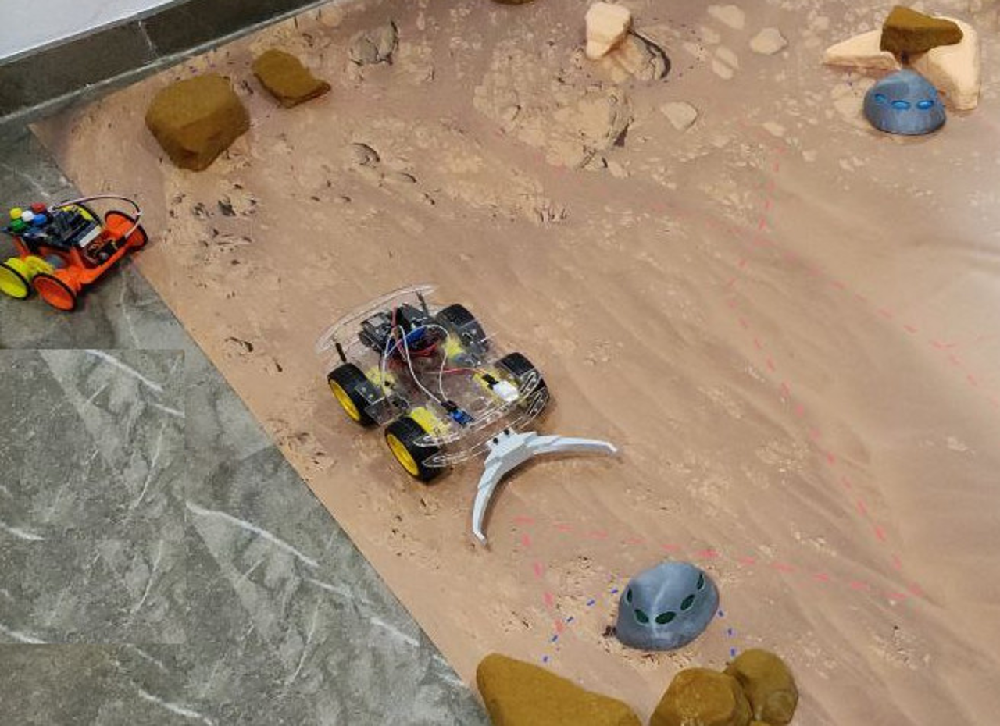
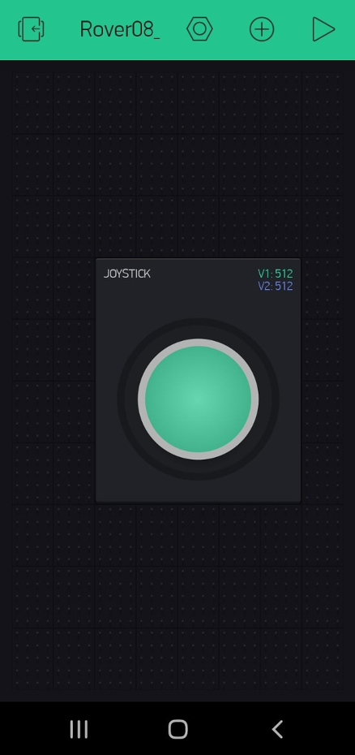

# **Misión Marte**

En contrucción

El robot [EscornaRover](https://www.thingiverse.com/thing:4911480) controlado remotamente con una app [App Inventor](http://ai2.appinventor.mit.edu) y equipado con un sensor de temperatura por infrarrojos explora la superficie de Marte buscando rocas con hielo y señalizando (luminoso-acústico) su localización.

|    |    |
| :-:| :-:|
|  |  |
| _EscornaRover Explorador_ | _App de control del EscornaRover_ |

El robot [Rover Marciano](http://www.cantabrobots.es/?page_id=1237), controlado con una app de la plataforma [Blynk](https://blynk.uptodown.com/android), se encarga de arrastrar a la roca localizada a la base de Marte.

|    |    |
| :-:| :-:|
|  |  |
| _Rover Marciano_ | _App de control del Rover_ |

