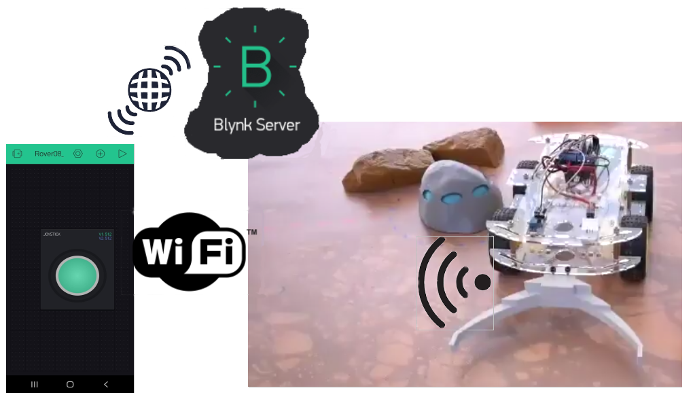
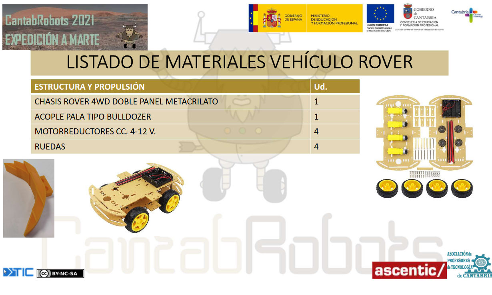
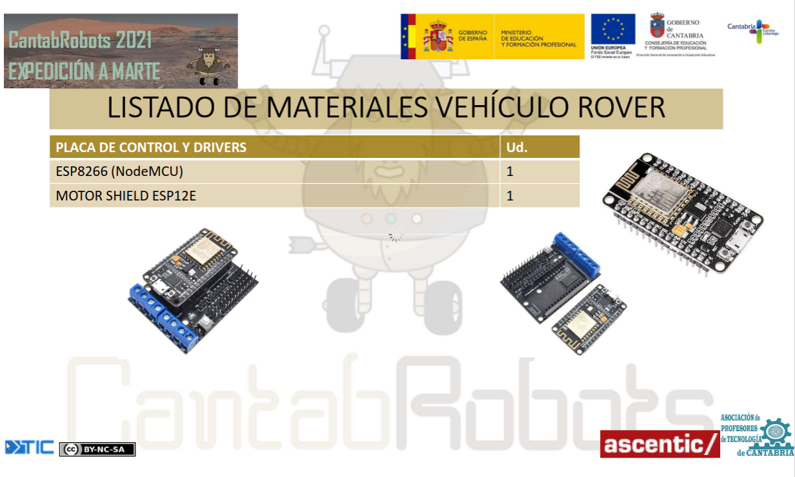
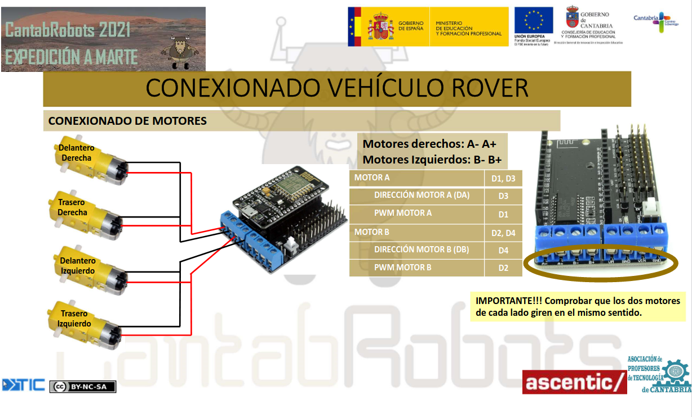
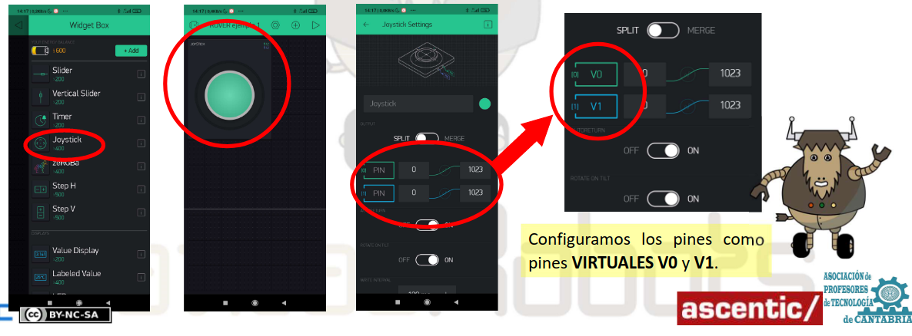
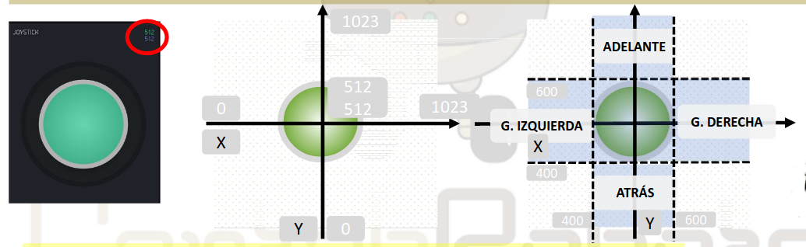
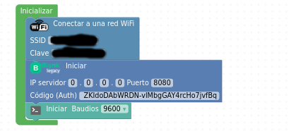
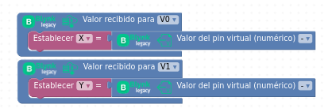
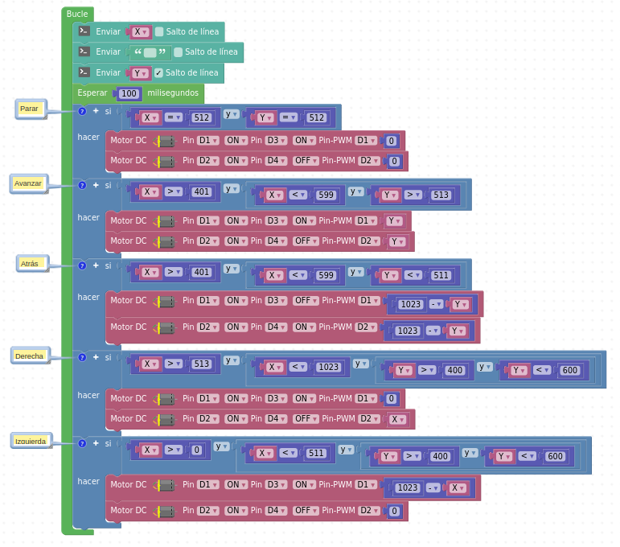

El robot [Rover Marciano](http://www.cantabrobots.es/?page_id=1237) creado y desarrollado por la comunidad [CantaRobots](http://www.cantabrobots.es/).

En la Misión a Marte hemos utilizado el robot [Rover Marciano](http://www.cantabrobots.es/?page_id=1237) para recoger, arrastrar y llevar las rocas con hielo a la base.
## **Elementos**
Los elementos de nuestro rover:

## **Conexionado de motores**

## **App de control**

### **Blynk**
Blynk es una plataforma de IoT independiente del hardware y basada en la nube que permite a los usuarios conectar hardware con la nube Blynk segura y de código abierto a través de wifi, 2G-4G, LTE o Ethernet.

[Arquitectura Blynk](https://docs.blynk.cc/#getting-started)

### **Programación App**
El control de la electrónica de los movimientos de robot rover se desarrolla con la plataforma [Blynk](https://blynk.uptodown.com/android) utilizando el widget **Joystick** y configurando los ejes como pines **Virtuales V0 y V1**.

Desde la app diseñada de [Blynk](https://blynk.uptodown.com/android) en el móvil enviamos los valores a las variables X e Y del programa [ArduinoBlocks](http://www.arduinoblocks.com) en el [Rover Marciano](http://www.cantabrobots.es/?page_id=1237).

El widget **Joystick** tiene dos ejes (X e Y) con valores entre 0 y 1023. En el punto de reposo, en el centro, X= 512 e Y= 512.

En el programa [ArduinoBlocks](http://www.arduinoblocks.com) utilizamos los valores entre 400 y 600 para los límites de los movimientos.

## **Programación ESP8266/NodeMCU**
La programación se desarrolla con el lenguaje visual de programación [ArduinoBlocks](http://www.arduinoblocks.com) para un proyecto tipo ESP8266/NodeMCU v2.

### **Inicialización comunicaciones**
En el bloque de "Inicializar" colocamos los bloques para conectarnos a la wifi poniendo el nombre (SSID) y la clave, el bloque de [Blynk](https://blynk.uptodown.com/android) para la comunicación con el servidor y el bloque de comunicación al puerto serie (opcional).

### **Recepción de datos**
De la App del móvil vamos a recibir datos correspondientes al movimiento del joystick. Estos datos se reciben por un bloque de [Blynk](https://blynk.uptodown.com/android) correspondiente a los pines virtuales declarados en la App y asignados a las variables X e Y del programa de robot.

### **Programa principal**
El bloque "Bucle" empieza con los bloques de instrucciones (opcionales) que envía el valor de las variables X e Y a la Consola (puerto serie) que recibe del la App de [Blynk](https://blynk.uptodown.com/android). Estos valores nos sirve para ajustar los movimientos del robot rover.

Los bloques de instrucciones condicionales determinan el movimiento del [Rover Marciano](http://www.cantabrobots.es/?page_id=1237) según los valores recibidos en las variables X e Y.

