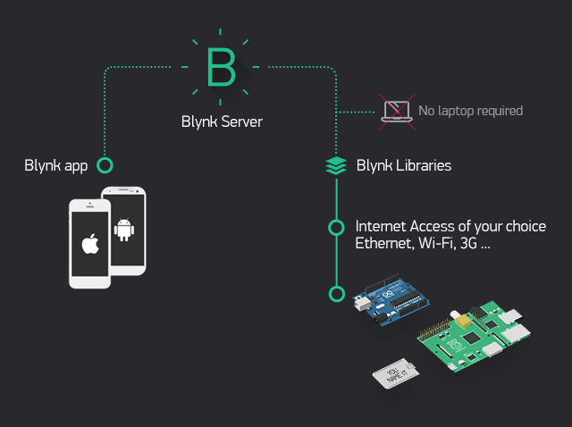

En contrucción

El robot [Rover Marciano](http://www.cantabrobots.es/?page_id=1237) creado y desarrollado por la comunidad [CantaRobots](http://www.cantabrobots.es/).

En la Misión a Marte hemos utilizado el robot [Rover Marciano](http://www.cantabrobots.es/?page_id=1237) para recoger, arrastrar y llevar las rocas con hielo a la base.
## Elementos
Los elementos de nuestro rover:

## Conexionado de motores

## Programación
La programación se desarrolla con el lenguaje visual de programación [ArduinoBlocks](http://www.arduinoblocks.com) para un proyecto tipo ESP8266/NodeMCU v2.

## App de control
El control de los movimientos de robot rover se desarrolla con la plataforma [Blynk](https://blynk.uptodown.com/android)

### Blynk
Blynk es una plataforma de IoT independiente del hardware y basada en la nube que permite a los usuarios conectar hardware con la nube Blynk segura y de código abierto a través de wifi, 2G-4G, LTE o Ethernet. Manuel

[Arquitectura Blynk](https://docs.blynk.cc/#getting-started)

Utilizando la widget prediseñada del joystick controlamos la electrónica que permite mover al Rover. Desde la app diseñada de [Blynk](https://blynk.uptodown.com/android) en el móvil enviamos los valores de X e Y al programa [ArduinoBlocks](http://www.arduinoblocks.com) en el [Rover Marciano](http://www.cantabrobots.es/?page_id=1237).

